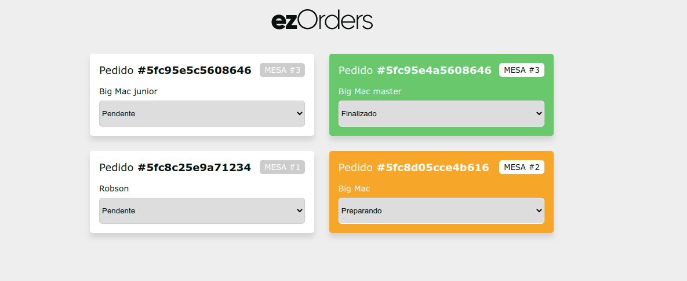

<h1 align="center">Projeto EzOrders</h1>

 

<h2 align="center">Print</h2>

  

## 🚀 Tecnologias

Esse projeto foi desenvolvido com as seguintes tecnologias:

- [Node.js](https://nodejs.org/en/)
- [EXPRESS]
- [SOCKET.IO]
- [REACTJS]
- [MongoDB]

## 💻 Projeto

Feito Durante o Curso JStack do Mateus Silva.
